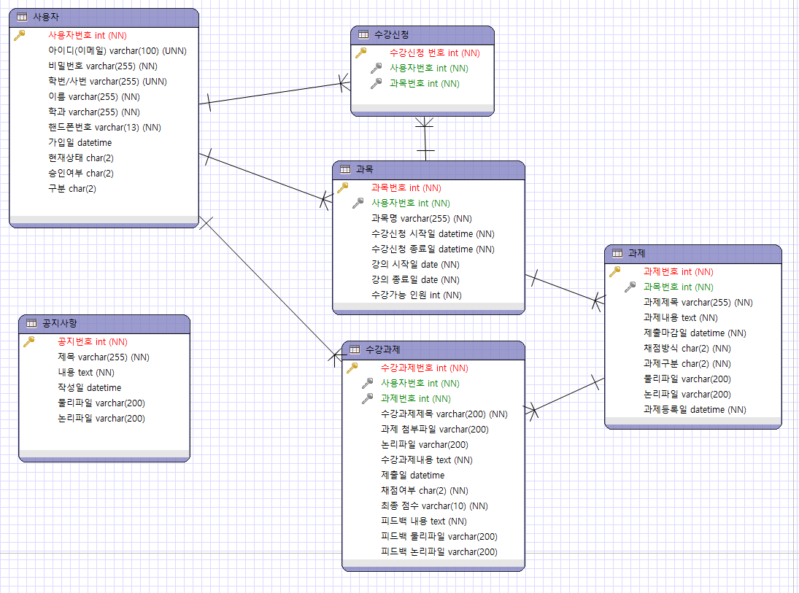
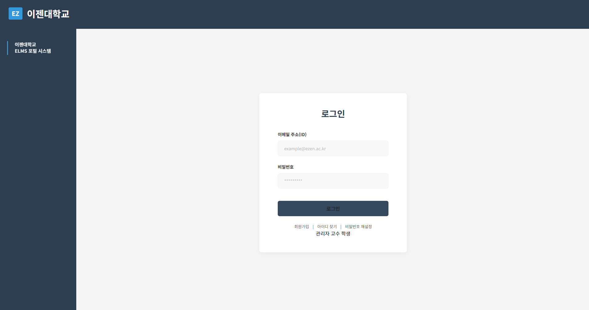
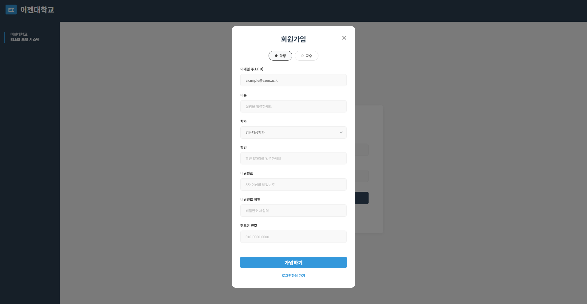
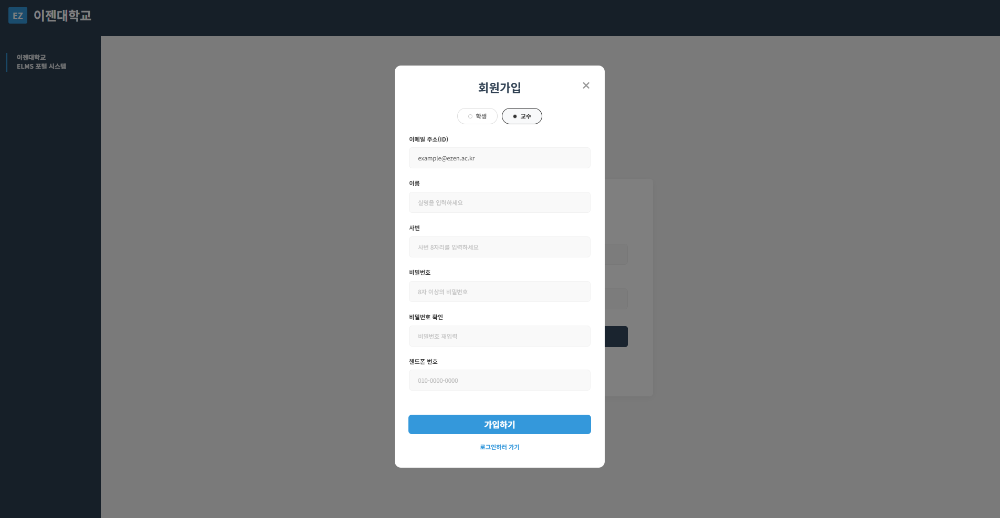
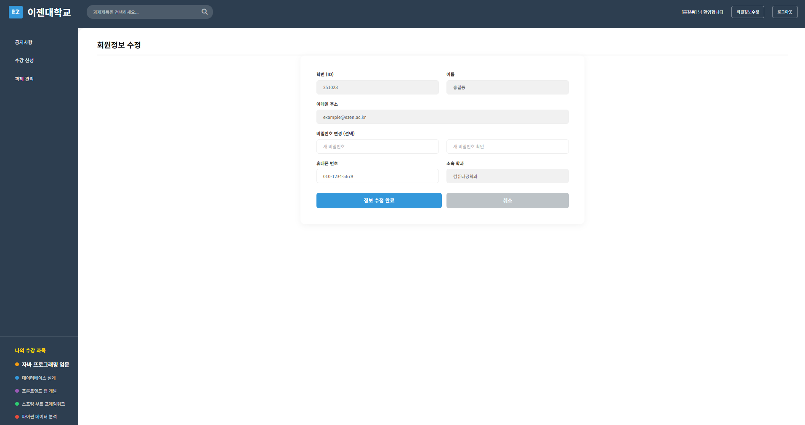
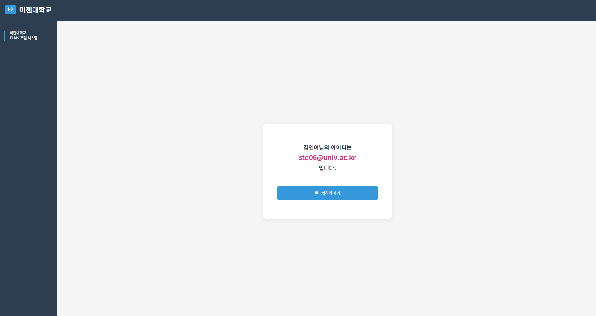
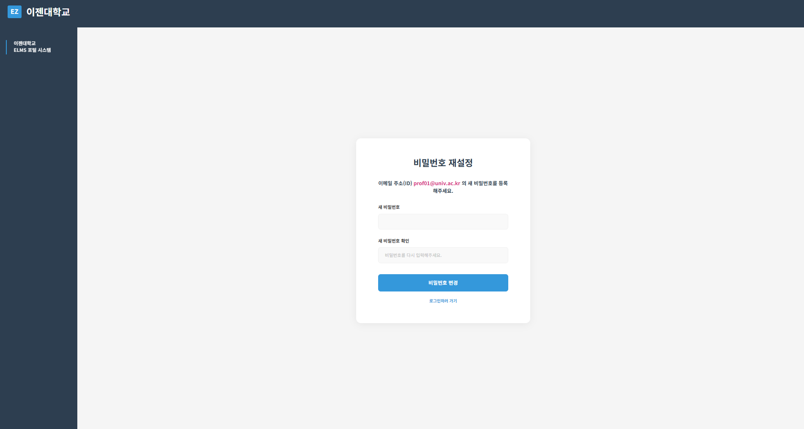

  
  <h3비대면 과제관리 시스템</h3>

## ⌨️ 기간

- **2026.01.19 ~ 2026.02.27(5주)**

 

## 🔎 목차

1. <a href="#subject">🎯 주제</a>
1. <a href="#mainContents">⭐️ 주요 기능</a>
1. <a href="#systemArchitecture">⚙ 시스템 아키텍쳐</a>
1. <a href="#skills">🛠️ 기술 스택</a>
1. <a href="#erd">💾 ERD</a>
1. <a href="#contents">🖥️ 화면 소개</a>
1. <a href="#developers">👥 팀원 소개</a>

 

<!------- 주제 시작 -------->

## 🎯 주제

**Ajax** 기반의 실시간 상호작용을 지원하는 비대면 과제 관리 플랫폼 
 
Ajax를 활용하여 화면 전환(Reload) 없이 과제 등록, 제출, 채점 프로세스를 구현함으로써 
웹 성능을 최적화하고 사용자 편의성을 극대화한 프로젝트입니다.

 

**주요 기능**

- 과목 등록, 과제 등록 등 모달창을 이용한 Ajax 통신을 이용하여 실시간 데이터 최신화
- 입력 데이터 유효성 검증, 비정상적인 접근 및 파라미터 변조 방지, 서버 측 예외 처리 등
  

<a href="#tableContents">목차로 이동</a>

 

<!------- 주요 기능 시작 -------->

## ⭐️ 주요 기능

### 공통

- 인터셉터를 통해 해당 페이지의 기능을 회원 등급에 맞게 제한합니다.    

---

### 관리자

- 공지사항 작성 및 관리합니다.
- 회원 관리(재학, 휴학, 퇴학, 퇴직 등)를 진행합니다.

---

### 교수

- 해당 교수가 수업할 과목을 등록, 수정, 삭제합니다.
  - 수강 신청한 학생이 있다면 과목 삭제를 제한합니다.
- 수업하는 과목의 과제를 등록, 수정, 삭제합니다.
  - 과제는 백분율 방식과 PASS or FALSE 방식에 맞게 등록할 수 있습니다.
  - 과제를 제출한 학생이 있다면 과제 삭제를 제한합니다.
- 학생이 제출한 과제를 채점 방식에 맞게 채점합니다.

---

### 학생

- 교수가 등록한 과목이 수강 신청 기간안에 포함되어 있다면 수강 신청 가능합니다.
- 수강 신청한 과목이 수강 신청 기간안에 있다면 수강 취소할 수 있습니다.
- 수강 신청한 과목의 과제가 제출 가능 기간이라면 제출, 수정, 삭제할 수 있습니다.
  - 비정상적인 접근으로 다른 학생의 과제로 들어갈때 프론트엔드와 백엔드에서 이중으로 접근을 제한합니다.
  - 이미 채점이 완료된 상태라면 수정, 삭제가 불가능합니다.

---

<a href="#tableContents">목차로 이동</a>

 

<!------- 시스템 아키텍쳐 시작 -------->

## ⚙ 시스템 아키텍쳐

- Frontend: HTML5, CSS3, JavaScript를 활용하여 깔끔하고 가독성 좋은 UI와 Ajax를 이용한 비동기 통신 환경을 구축 
- Backend & DB: Spring 프레임워크를 사용하여 서버를 구현하였으며, MySQL을 통해 교수, 학생 데이터를 관리

본 프로젝트는 Spring MVC 아키텍처를 기반으로 설계된 비대면 과제 관리 플랫폼입니다. 
Ajax를 활용한 비동기 통신 구조를 채택하여 화면 전환 없는 매끄러운 사용자 경험을 제공하며, 
관리자·교수·학생 각 사용자 역할에 최적화된 비즈니스 로직을 독립적으로 처리할 수 있도록 시스템 아키텍처를 구축하였습니다.

<a href="#tableContents">목차로 이동</a>

 

<!------- 기술 스택 시작 -------->

## 🛠️ 기술 스택

### 💻 FrontEnd

---

### ⚙️ BackEnd

---

### 🤝 Collaboration

---

<a href="#tableContents">목차로 이동</a>

 

<!------- ERD 시작 -------->

## 💾 ERD

<a href="#tableContents">목차로 이동</a>

 

<!------- 화면 소개 시작 -------->

 

## 🖥️ 화면 소개

### 1. 공통

<table>
    <tr>
        <td align="center" width="200">
            <h5>로그인 페이지</h5>
              
        </td>
        <td align="center" width="200">
            <h5>학생 회원가입 모달</h5>
              
        </td> 
        <td align="center" width="200">
            <h5>교수 회원가입 모달</h5>
            
        </td>
        <td align="center" width="200">
            <h5>개인정보변경</h5>
            
        </td>
        <td align="center" width="200">
            <h5>아이디 찾기 완료</h5>
            
        </td>
        <td align="center" width="200">
            <h5>비밀번호 재설정</h5>
            
        </td>
    </tr>
    <tr>
      <td align="center">
        
✔ 회원가입한 이메일과 비밀번호 입력 후 로그인

        
✔ 프론트엔드, 백엔드 유효성 검사

      </td>
      <td align="center">
        
✔ 학생 회원가입 모달창

        
✔ 이메일 중복 검사 등 회원가입에 필요한 유효성 검사

      </td>
      <td align="center">
        
✔ 교수 회원가입 모달창

        
✔ DB 유저타입을 학생과 구분되어 가입

      </td>
      <td align="center">
        
✔ 비밀번호 변경 및 휴대폰 변경 가능(선택사항)

      </td>
      <td align="center">
        
✔ 아이디 찾기에 필요한 정보를 입력 후 정보에 해당되는 이메일이 있으면 표시

      </td>
      <td align="center">
        
✔ 비밀번호 찾기에 필요한 정보 입력 후 정보에 해당되는 유저가 있으면 비밀번호 재설정 가능

      </td>
    </tr>
</table>

### 2. 상세 페이지

<table>
    <tr>
        <td align="center" width="200">
            <h5>상세 페이지 화면</h5>
              
        </td>
        <td align="center" width="200">
            <h5>상세 페이지 분석 및 시각화</h5>
              
        </td>
    </tr>
    <tr>
      <td align="center">
        
✔ 현재 페이지의 제품과 유사한 상품 화면에 표시

      </td>
      <td align="center">
        
✔ 현재 페이지 상품과 유사한 제품을 분석 및 Heatmap으로 시각화

      </td>
    </tr>
</table>

### 3. 장바구니

<table>
    <tr>
        <td align="center" width="200">
            <h5>장바구니 화면</h5>
              
        </td>
        <td align="center" width="200">
            <h5>장바구니 분석</h5>
              
        </td>
    </tr>
    <tr>
      <td align="center">
        
✔ 장바구니 담은 상품 비동기 통신(AJAX)을 통한수량 및 가격 변경

      </td>
      <td align="center">
        
✔ 장바구니에 담은 상품과 유사한 상품을 분석 및 시각화

      </td>
    </tr>
</table>

### 4. 구매내역

<table>
    <tr>
        <td align="center" width="200">
            <h5>구매내역 화면</h5>
              
        </td>
        <td align="center" width="200">
            <h5>구매내역 분석</h5>
              
        </td>
    </tr>
    <tr>
      <td align="center">
        
✔ 구매내역을 전체, 1개월, 3개월 필터화

      </td>
      <td align="center">
        
✔ 구매한 상품과 유사한 상품을 분석 및 시각화

      </td>
    </tr>
</table>

<a href="#tableContents">목차로 이동</a>

 

### ✔ 프로젝트 결과물

---

<!-- - [포팅메뉴얼] -->
<!-- - [발표자료] -->
- [중간발표자료](./ppt/중간발표_eLMS.pdf)
- [최종발표자료](./ppt/최종발표_eLMS.pdf)

<!------- 팀원 소개 시작 -------->

## 👥 팀원 소개

<table>
    <tr>
        <td align="center" width="200">
            <h5>Name</h5>
        </td>
        <td align="center" width="200">
            <h5>진선용</h5>
        </td>
        <td align="center" width="200">
            <h5>박세연</h5>
        </td>
        <td align="center" width="200">
            <h5>박윤희</h5>
        </td>
        <td align="center" width="200">
            <h5>박정희</h5>
        </td>
        <td align="center" width="200">
            <h5>백세원</h5>
        </td>
        <td align="center" width="200">
            <h5>정정원</h5>
        </td>
    </tr>
    <tr>
        <td align="center" width="200">
            <h5>역할</h5>
        </td>
        <td align="center" width="200">
            <h5>풀스택</h5>
        </td>
        <td align="center" width="200">
            <h5>프론트엔드</h5>
        </td>
        <td align="center" width="200">
            <h5>풀스택</h5>
        </td>
        <td align="center" width="200">
            <h5>프론트엔드</h5>
        </td>
        <td align="center" width="200">
            <h5>풀스택</h5>
        </td>
        <td align="center" width="200">
            <h5>프론트엔드</h5>
        </td>
    </tr>
</table>

<a href="#tableContents">목차로 이동</a>

